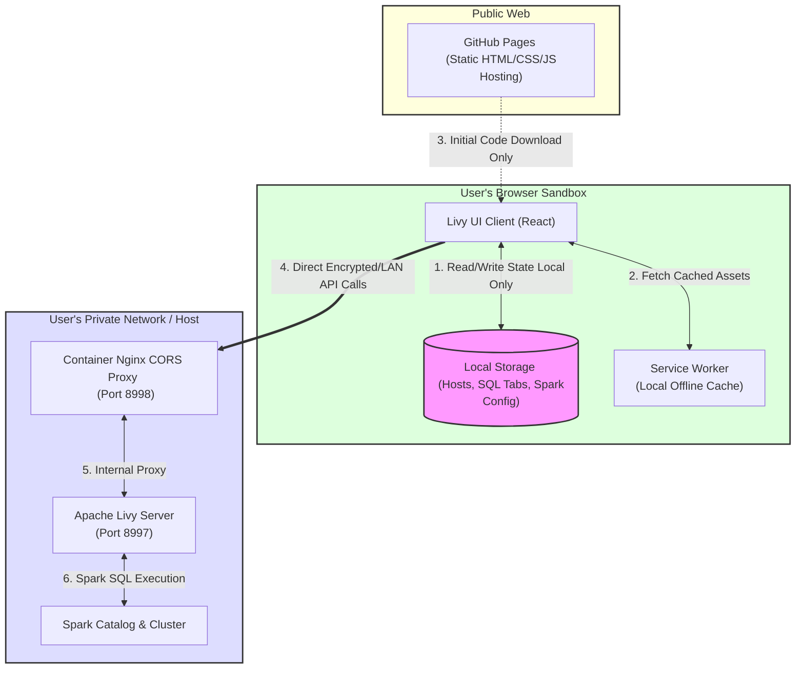

# Privacy Policy & Data Handling

The **Livy UI** project is built with user privacy and data security as a core architectural principle. This document outlines how data is stored, processed, and transmitted.

---

## 1. Core Privacy Principles

Livy UI is a **100% client-side static application**. It does not collect, log, track, or share your data with any external third parties or central servers.

---

## 2. Detailed Data Handling

### I. SQL Queries & Execution Results
*   **Where they live:** All SQL queries you write, execute, or view remain inside your browser sandbox and your local Apache Livy instance.
*   **Transmission:** Queries are transmitted directly from your browser to your configured Apache Livy host. They **never** route through any intermediary or proxy servers hosted by the developers.
*   **Results:** Query execution results are returned directly to your browser and kept in volatile JavaScript memory. They are never written to any cloud database or telemetry service.

### II. Host Settings & Configurations
*   **Where they live:** Connection URLs, active server IDs, and custom Spark session configurations are saved in the browser's `localStorage`.
*   **Transmission:** This data is only loaded locally into React state when opening the app. It is never transmitted across the network, except for direct API calls to connect to your configured Livy servers.

### III. Offline Assets (PWA)
*   **Where they live:** The application shell assets (scripts, styles, Monaco Editor assets) are cached in your browser's Cache Storage via a Service Worker (`sw.js`).
*   **Scope:** This is standard browser caching that allows you to run the SQL editor even when you have no internet access.

---

## 3. Security Boundary Analysis

| Feature | Data Location | Network Path | Third-Party Access |
| :--- | :--- | :--- | :--- |
| **SQL Editor Workspace** | Browser `localStorage` | None (Local Read/Write) | **Zero** |
| **Livy Host List** | Browser `localStorage` | None (Local Read/Write) | **Zero** |
| **SQL Execution** | Browser Memory | Direct to user-specified Livy Host | **Zero** |
| **PWA Cache** | Browser Cache Storage | HTTPS download from GitHub Pages (Initial setup only) | **Zero** (Only standard host requests) |
| **Analytics & Telemetry** | N/A (None used) | No network calls made | **Zero** |

---

## 4. User Control & Data Deletion

Because all your data is stored locally in the browser, you have absolute control over it. 

To permanently erase all workspace settings, active connections, and SQL history:
1. Open your browser's Developer Tools (`F12` / `Cmd+Option+I`).
2. Go to the **Application** tab (Chrome) or **Storage** tab (Firefox/Safari).
3. Select **Clear Site Data** (or delete `localStorage` entries for the domain).
4. Reload the page. All workspace configurations will be permanently deleted.
