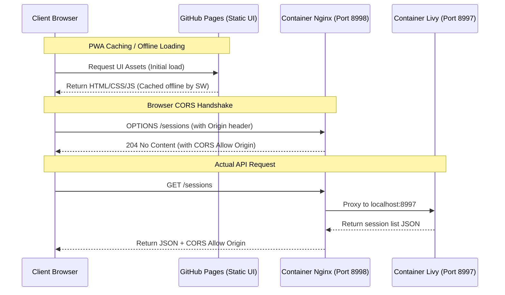

# Livy UI

A modern web-based SQL editor for [Apache Livy](https://livy.incubator.apache.org/), built with React 19, Vite 7, and Monaco Editor. Write, run, and manage Spark SQL queries against remote Livy servers — all from your browser.

   

## Features

- **Progressive Web App (PWA)** — Installable web app with service worker asset caching, manifest icons, and offline loopback execution
- **Connection Health & Reachability** — Real-time server status indicators (`Online`, `Offline`, `Server Down`) with periodic health checks
- **Compute Resource Manager** — Fine-grained cluster configuration presets (memory, CPU cores, custom Spark submit options)
- **Multi-tab SQL Editor** — Create, rename, and manage multiple SQL files with Monaco Editor
- **Spark SQL Autocomplete** — Built-in completion for 300+ Spark SQL functions and keywords with documentation on hover
- **Smart SQL Snippets** — Interactive boilerplate templates for common Spark SQL operations with tab-stop navigation
- **Keyboard Shortcuts** — VS Code-style shortcuts for sidebar, result panel, tabs, and query execution
- **Query Execution** — Run queries against any Livy server with live elapsed timer, cancellation, and comment-based run history titles
- **Result Table** — Structured table display with column data types, row counts, and execution time
- **EXPLAIN Plan Viewer** — Syntax-highlighted execution plan display for EXPLAIN queries
- **Schema Explorer** — Collapsible left sidebar with lazy-loaded tree view of databases, tables, and columns
- **Session Management** — Start, stop, and monitor Spark sessions with real-time status
- **Session Configuration** — Pass custom Spark properties (e.g. Hive metastore, executor memory) when creating sessions
- **Multi-host Support** — Connect to multiple Livy servers and switch between them
- **HDFS / Parquet Support** — Query HDFS files directly using Spark SQL path-based table syntax
- **Dark Theme** — Modern dark UI optimized for long coding sessions
- **LocalStorage Persistence** — All hosts, SQL files, session config, and session info persist across browser reloads
- **CORS Proxy** — Embedded Nginx reverse proxy handles cross-origin requests to any Livy host on port 8998

## Tech Stack

| Layer       | Technology                          |
| ----------- | ----------------------------------- |
| Framework   | React 19                            |
| Bundler     | Vite 7.3                            |
| Styling     | Tailwind CSS v4                     |
| Editor      | Monaco Editor (`@monaco-editor/react`) |
| HTTP Client | Axios                               |
| Icons       | Lucide React                        |
| SQL Format  | sql-formatter                       |

## Getting Started

### Prerequisites

- **Node.js** >= 18
- **npm** >= 9
- A running [Apache Livy](https://livy.incubator.apache.org/) server

### Install & Run

```bash
# Clone the repository
git clone <repo-url>
cd livy-ui

# Install dependencies
npm install

# Start dev server
npm run dev
```

Open [http://localhost:5173](http://localhost:5173) in your browser.

### Connect to Livy

1. Click the **Connect** button in the navbar
2. Enter your Livy server URL (e.g., `http://your-livy-host:8998`)
3. Click **Add Host** and select it
4. Start a Spark session using the **Start Session** button

## HDFS & Data Access

This app supports querying data stored on HDFS, S3, or any Spark-compatible file system directly from the SQL editor.

### Querying HDFS Files Directly

Use Spark SQL's **path-based table syntax** to read files without registering them in a catalog:

```sql
-- Parquet files
SELECT * FROM parquet.`hdfs://namenode/path/to/data` LIMIT 100

-- CSV files
SELECT * FROM csv.`hdfs://namenode/path/to/data.csv`

-- JSON files
SELECT * FROM json.`hdfs://namenode/path/to/data.json`

-- ORC files
SELECT * FROM orc.`hdfs://namenode/path/to/data`
```

> **Note:** Path-based tables do not appear in the Schema Explorer since they are not registered in any database catalog.

### Registering Tables for Schema Explorer

To make HDFS data visible in the Schema Explorer sidebar, register it as a named table:

```sql
CREATE TABLE IF NOT EXISTS default.my_table
USING parquet
LOCATION 'hdfs://namenode/path/to/data'
```

After running this, click **Refresh** in the Schema Explorer to see the table, its columns, and data types.

### Schema Explorer

The left sidebar provides a tree view of your Spark SQL catalog:

```
Databases
└── default
    └── my_table
        ├── id (bigint)
        ├── name (string)
        └── created_at (timestamp)
```

- **Lazy loading** — Tables and columns are fetched on expand
- **Copy to clipboard** — Click the copy icon on any node to copy its qualified name
- **Refresh** — Reload the full tree after creating or dropping tables
- **Collapsible** — Toggle the sidebar with the panel icon

### Session Configuration

Pass custom Spark properties when starting a new session via **Settings → Session Configuration**:

| Property | Purpose | Example |
|----------|---------|--------|
| `spark.hadoop.hive.metastore.uris` | Connect to a Hive metastore | `thrift://hive-metastore:9083` |
| `spark.sql.warehouse.dir` | Default storage for managed tables | `hdfs://namenode/user/hive/warehouse` |
| `spark.hadoop.fs.defaultFS` | Default HDFS namenode | `hdfs://namenode:8020` |
| `spark.executor.memory` | Executor memory | `4g` |
| `spark.executor.cores` | Executor cores | `2` |
| `spark.dynamicAllocation.enabled` | Enable dynamic allocation | `true` |
| `spark.sql.shuffle.partitions` | Shuffle partitions | `200` |

Config is persisted in localStorage and sent with every new session creation.

> **Tip:** If your Livy server already runs on a Hadoop cluster with Hive configured, you typically don't need any session config — Spark inherits the cluster's `core-site.xml` and `hive-site.xml` automatically.

### SQL Snippets

The editor includes preloaded interactive templates for common Spark SQL operations. Start typing a snippet prefix (e.g. `create_`) and select it from the autocomplete menu. Once inserted, use **Tab** to jump between placeholders (table names, file paths, options) to fill out your query quickly.

| Snippet | Description |
|---------|-------------|
| `create_table_parquet` | Create a table using Parquet format over HDFS/local storage |
| `create_view_csv` | Mount a CSV file with header and schema inference options |
| `create_view_json` | Create a temporary view from a JSON file |
| `select_limit` | Scaffold a quick `SELECT * FROM ... LIMIT` query |

### EXPLAIN Plan Viewer

Prefix any query with `EXPLAIN` to view Spark's execution plan directly in the result panel with syntax-highlighted operators.

| Statement | What it shows |
|-----------|---------------|
| `EXPLAIN <query>` | Physical plan only (default) |
| `EXPLAIN EXTENDED <query>` | Parsed, Analyzed, Optimized logical plans + Physical plan |
| `EXPLAIN CODEGEN <query>` | Generated Java code for the query |
| `EXPLAIN COST <query>` | Logical plan with cost/statistics info |
| `EXPLAIN FORMATTED <query>` | Physical plan in a more readable, sectioned format |

Example:

```sql
EXPLAIN EXTENDED
SELECT * FROM parquet.`hdfs://namenode/path/to/data` LIMIT 100
```

### Keyboard Shortcuts

| Shortcut (Windows/Linux) | Shortcut (macOS) | Action | Scope |
|--------------------------|------------------|--------|-------|
| `Ctrl+Enter` | `⌘+Enter` | **Run SQL** (selected text or all) | Global / Editor |
| `Ctrl+Shift+F` | `⌘+Shift+F` | **Format SQL** (statement-by-statement) | Editor |
| `Ctrl+Shift+M` | `⌘+Shift+M` | **Minify SQL** (statement-by-statement) | Editor |
| `Ctrl+S` | `⌘+S` | **Save SQL file** | Editor |
| `Ctrl+Shift+A` | `⌘+Shift+A` | **Toggle Auto-Save** | Editor |
| `Alt+Z` | `⌥+Z` | **Toggle Word Wrap** (VS Code style) | Editor |
| `Ctrl+B` | `⌘+B` | **Toggle sidebar** | Global / Editor |
| `Ctrl+Shift+E` | `⌘+Shift+E` | **Focus File Explorer** | Global / Editor |
| `Ctrl+Shift+K` | `⌘+Shift+K` | **Focus Schema Explorer** | Global / Editor |
| `` Ctrl+` `` | `` ⌘+` `` | **Toggle result panel** | Global / Editor |
| `Ctrl+Alt+N` | `⌘+⌥+N` | **New SQL file** (VS Code-like browser override) | Global / Editor |
| `Ctrl+Alt+W` | `⌘+⌥+W` | **Close active tab** (VS Code-like browser override) | Global / Editor |
| `Ctrl+Shift+T` / `Ctrl+Alt+T` | `⌘+Shift+T` / `⌘+⌥+T` | **Restore last closed tab** | Global / Editor |
| `Ctrl+PageUp` / `Ctrl+Alt+←` | `⌘+PageUp` / `⌘+⌥+←` | **Previous tab** | Global / Editor |
| `Ctrl+PageDown` / `Ctrl+Alt+→` | `⌘+PageDown` / `⌘+⌥+→` | **Next tab** | Global / Editor |
| `Ctrl+H` | `⌘+H` | **Query history** | Global / Editor |
| `Ctrl+.` | `⌘+.` | **Manage Livy hosts** | Global / Editor |
| `Ctrl+/` | `⌘+/` | **Show keyboard shortcuts** | Global / Editor |
| `F2` | `F2` | **Rename file** | File Explorer |
| `Del` | `Delete` / `Backspace` | **Delete file** | File Explorer |
| `Esc` | `Esc` | **Close modals / dropdowns** | Global |

## Docker

The multi-stage Dockerfile fetches source directly from GitHub — no local checkout needed.

### Multi-Stage Build

| Stage | Base Image | Purpose |
|-------|------------|--------|
| **Stage 0** (`git-fetch`) | `alpine/git` | Shallow-clones the repo from GitHub |
| **Stage 1** (`build`) | `node:22-alpine` | Installs dependencies and builds the app |
| **Stage 2** (production) | `node:22-alpine` | Serves the production build via `vite preview` |

### Build & Run

```bash
# Build the image (fetches code from GitHub automatically)
docker build -t livy-ui .

# Build from a specific branch
docker build --build-arg GIT_BRANCH=feature/v1.4.7 -t livy-ui .

# Run the container
docker run -p 4173:4173 livy-ui
```

Open [http://localhost:4173](http://localhost:4173).

### Docker Compose

The `docker-compose.yml` spins up both the **Livy server** and **Livy UI** together:

```bash
# Start all services
docker compose up --build

# Start in detached mode
docker compose up --build -d

# Stop all services
docker compose down
```

| Service | Container | Ports | Description |
|---------|-----------|-------|-------------|
| `livy` | `livy-server` | `8998`, `4040-4050` | Apache Livy server with Spark |
| `livy-ui` | `livy-ui` | `4173` | Livy UI web application |

After starting, open [http://localhost:4173](http://localhost:4173) for the UI and [http://localhost:8998](http://localhost:8998) for the Livy REST API.

#### Customizing the Compose Build

You can override the Git repo and branch in `docker-compose.yml` under `livy-ui.build.args`:

```yaml
args:
  GIT_REPO: https://github.com/ErVijayRaghuwanshi/livy-ui.git
  GIT_BRANCH: main
```

## Project Structure

```
livy-ui/
├── Dockerfile                  # Multi-stage build (git-fetch → build → production)
├── DockerfileLivy              # Livy server Dockerfile
├── docker-compose.yml          # Compose: Livy server + Livy UI
├── livy.conf                   # Livy server configuration
├── nginx-cors.conf             # Standalone Nginx configuration for Livy container CORS
├── CHANGELOG.md                 # Version changelog history
├── PRIVACY.md                   # Privacy policy & data handling documentation
├── release-notes/               # Version release notes (v1.1.1 through v1.4.7)
├── .dockerignore
├── index.html
├── package.json
├── vite.config.js              # Vite config + PWA options
└── src/
    ├── main.jsx                # App entry point
    ├── App.jsx                 # Root layout with sidebar + resizable panels
    ├── index.css               # Tailwind v4 + CSS variables (dark theme)
    ├── components/
    │   ├── Navbar.jsx          # Connection status, session controls
    │   ├── ConnectionModal.jsx # Host management + session configuration
    │   ├── TabBar.jsx          # Multi-tab SQL file management
    │   ├── SqlEditor.jsx       # Monaco Editor with Spark SQL support
    │   ├── ResultTable.jsx     # Query results with data types & timing
    │   └── SchemaExplorer.jsx  # Database/table/column tree sidebar
    ├── context/
    │   ├── LivyContext.jsx     # Livy session, connection & config state
    │   └── SqlFilesContext.jsx # SQL files (tabs) state & persistence
    ├── services/
    │   ├── axiosConfig.js      # Axios client configured for direct Livy API requests
    │   └── livyApi.js          # Livy REST API + runSql helper
    └── utils/
        ├── constants.js        # App constants & storage keys
        ├── localStorage.js     # localStorage helpers
        ├── spark-functions-data.js  # 300+ Spark SQL function definitions
        ├── spark-keywords-data.js   # Spark SQL keywords
        └── spark_sql_snippets.js    # Interactive SQL snippet templates
```

## Architecture & CORS Handling

When connecting a web application to a local or internal Apache Livy server, browsers enforce strict security limits:
1. **Mixed Content Block**: A secure HTTPS site (like GitHub Pages) is not allowed to query an insecure HTTP endpoint (like a local server). This is bypassed by setting Chrome's site settings to **Allow Insecure Content** on the GitHub Pages domain.
2. **CORS (Cross-Origin Resource Sharing)**: Browsers block a web app hosted on one domain (e.g., `https://ervijayraghuwanshi.github.io`) from querying another domain (e.g., `http://localhost:8998` or `http://10.29.93.216:8998`) unless the destination server explicitly returns CORS approval headers.

To resolve these challenges without needing external proxies, the architecture is configured as follows:



### 1. Unified Livy + CORS Proxy Container
Apache Livy has no native CORS configuration support. Instead of adding an extra Docker container, **Nginx is packaged directly inside the `livy-server` image**:
- The embedded Livy JVM process is configured to bind internally to port `8997` (configured in [livy.conf](file:///Users/ervijay/Documents/Programs/Repo/livy-ui/livy.conf)).
- A lightweight Nginx process (running in user-space under Spark user `185`) binds to public port `8998` (configured in `nginx-cors.conf`).
- Nginx intercepts all traffic, automatically handles preflight `OPTIONS` requests, appends the appropriate `Access-Control-Allow-Origin` headers matching the client's origin, and proxies the requests to Livy on port `8997`.

This means your local Livy server is natively CORS-compliant out of the box for any developer UI (GitHub Pages, local server, or local network IPs).

### 2. Progressive Web App (PWA) & Offline Capabilities
The UI uses `vite-plugin-pwa` with Workbox to cache all static pages, assets, and the Monaco SQL editor:
- **Offline Mode**: If you disconnect from the internet/Wi-Fi and refresh the page, the application still loads and runs fully offline.
- **Local Loopback Exception**: If you are disconnected from the network, the app recognizes if the target is `localhost` or `127.0.0.1` and bypasses the browser's global offline status check. You can continue running Spark queries against your local container offline.
- **Installable**: The app can be installed directly onto your desktop or mobile home screen as a standalone application.

## Scripts

| Command           | Description                        |
| ----------------- | ---------------------------------- |
| `npm run dev`     | Start dev server (port 5173)       |
| `npm run build`   | Build for production               |
| `npm run preview` | Preview production build (port 4173) |

## License

MIT
